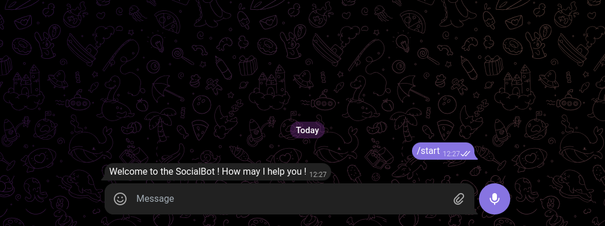

### Creation of the BOT in Telegram

- make use of the `botfather` in telegram

```
name: Social Bot
username: social_post_new_bot (must end with bot)
```

- Copy the token generated fropm here

```
Done! Congratulations on your new bot. You will find it at t.me/social_post_new_bot. You can now add a description, about section and profile picture for your bot, see /help for a list of commands. By the way, when you've finished creating your cool bot, ping our Bot Support if you want a better username for it. Just make sure the bot is fully operational before you do this.

Use this token to access the HTTP API:
6850797356:AAES8nHJ315YogH2I46VOcOD2kA-e8g0rmw
Keep your token secure and store it safely, it can be used by anyone to control your bot.

For a description of the Bot API, see this page: https://core.telegram.org/bots/api
```

- Token is and add it into the `.env` file for the further use the APIs of teelegram

```
6850797356:AAES8nHJ315YogH2I46VOcOD2kA-e8g0rmw
```

- Add it in the .env file as below

```
TELEGRAM_BOT_API=6850797356:AAES8nHJ315YogH2I46VOcOD2kA-e8g0rmw
```

- Initialise the node project `npm init`

- Adding the `dev` script as `nodemon server.js`

- Add the `server.js` file

### Install Dependecies

- Dev Dependencies `(npm i -D <packages>)`

```
nodemon
dotenv
```

- `NOTE`: Check for ndoe version and install `nvm` to switch to latest node versions

```
nvm install node
```

- Try running demo script in the `server.js`

```
npm run dev
```

- USe library `telegraf` => using this it makes it easy to create the BOTS

```
npm install telegraf
```

- USe library `openai-node` => using this library to integrate the `OPENAI APIs`

```
npm install openai
```

- Start Building the application(server.js)

- Over bot we can have multiple optionms to runs we will recive the Context of the user who started the Bot;

```
bot.start(async(ctx) =>{
  console.log('ctx', ctx)
  console.log("Welcome to Bot !! Its working");
})

// to lauch the Bot
bot.launch();
```

- For the graceful termination we can get it using the System Signals like as follows

```
process.once('SIGINT', ()=> bot.stop('SIGINT'));
process.once('SIGTERM', ()=> bot.stop('SIGTERM'));
```

- Further in package.json to read env file modify the dev script as

```
"dev": "nodemon --env-file=.env server.js"
```

- If we want to use the import syntax(esm syntax); we can add into package.json

```
"type": "module"
```

- Run the dev script; It runs without eany errors

- Rather than logging the message we could reply the user with the context

```
await ctx.reply("Welcome to the SocialBot ! How may I help you !")
```

- To check for our details on the Bot we need to search for our bot on Telegram by `username`!!?

```
username: social_post_new_bot
```

- We should start the bot using the `start` button over there; keeping the dev script running
- The start command will look like this

```
/start
```



- `NOTE`: In telegram commands generally the commands are prefixed with the `/`;
- We should store the message information

- Rather than using the `console.log('Welcome to social Bot its working')` we can rather use the ffollowing

```
await ctx.reply("Welcome to the SocialBot ! How may I help you !")
```

- we will get the inforamtaion like as follows

```
ctx Context {
  update: {
    update_id: 283033655,
    message: {
      message_id: 6,
      from: [Object],
      chat: [Object],
      date: 1712991449,
      text: '/start',
      entities: [Array]
    }
  },
  telegram: Telegram {
    token: '6850797356:AAES8nHJ315YogH2I46VOcOD2kA-e8g0rmw',
    response: undefined,
    options: {
      apiRoot: 'https://api.telegram.org',
      apiMode: 'bot',
      webhookReply: true,
      agent: [Agent],
      attachmentAgent: undefined,
      testEnv: false
    }
  },
  botInfo: {
    id: 6850797356,
    is_bot: true,
  }
```

- Now we will further need the inforamtion of the users

### Store the USerInformation in DB

- When we will use teh OPENAI APIs then we need to track the how many users are using how many number of Tokens and if the users are using more tokens then we can handle it differently

- For managing users we are going to need `MongoDBs mongoose`
- Install mongoose

```
npm install mogoose
```

- Create folder structure `src/models/Users.js` to add our model

```
import mongoose from "mongoose";

const userSchema = mongoose.Schema({

})
```

- in the schema we will need to add the further details as follows like

```
- telegramId
- firstname
- lastname
- isBot (If user or a bot)
- username (Shoule be different to validate)
# we need two more fields which will be nessasary when we waill call OpenAIs API
- promptToken
- completionTokens

```

- We will need a timestamp further so we will have it as follows like

```
import mongoose from "mongoose";

const userSchema = mongoose.Schema({

}, {timestamps:true})

export default mongoose.model('User', userSchema)
```

- Import the model in server.js as follows

```
import userSchema from "./src/models/Users.js"
```

- to fetch the users from we will get it as follows => path to the user will be`Context.update.message.from`

```
ctx Context {
  update: {
    update_id: 283033655,
    message: {
      message_id: 6,
      from: [Object],
      chat: [Object],
      date: 1712991449,
      text: '/start',
      entities: [Array]
    }
  },
  telegram: Telegram {
    token: '6850797356:AAES8nHJ315YogH2I46VOcOD2kA-e8g0rmw',
    response: undefined,
    options: {
      apiRoot: 'https://api.telegram.org',
      apiMode: 'bot',
      webhookReply: true,
      agent: [Agent],
      attachmentAgent: undefined,
      testEnv: false
    }
  },
  botInfo: {
    id: 6850797356,
    is_bot: true,
  }
```

- So we will add it as follows like

```
const from = ctx.update.message.from;
console.log('from', from);
```

- It will throwout the o/p as

```
rom {
  id: 5350291138,
  is_bot: false,
  first_name: 'Aditya',
  last_name: 'Dhopade',
  language_code: 'en'
}
```

- we will store this data into Db; Adding the data into the database
- Add it into the try catch block first
- `findOneAndUpdate` it helps us to avoid the user from running `start` command; if already existing in our DB(passing the telegramid to it i.e. tgId in our case)
- `upsert `: If there is no record it will create or if it exists the it will update that record.

```
  try {
    await userModel.findOneAndUpdate()
  }catch(err){

  }
```

- Further we also need to set something on that insert we can have it as follows like `$setOnInsert` with the values like firstname, lastname, username, isBot

```
  try {
    await userModel.findOneAndUpdate({tgId: from.id}, {
      $setOnInsert: {
        firstName: from.first_name,
        lastName: from.last_name,
        isBot: from.is_bot,
        username: from.username,
      }
    },)
  }catch(err){

  }
```

- Adding another rd object parameter `upsert` (it will return us the new record ) here we will get it as follows

```
{ upsert:true, new: true }
```

- It will look like as follows

```
  try {
    await userModel.findOneAndUpdate({tgId: from.id}, {
      $setOnInsert: {
        firstName: from.first_name,
        lastName: from.last_name,
        isBot: from.is_bot,
        username: from.username,
      }
    }, { upsert:true, new: true }
    )
  }catch(err){

  }
```

- We can change the ctx message from the ` await ctx.reply("Welcome to the SocialBot ! How may I help you !")` to something else

```
 await ctx.reply("Hey ${from.first_name}, Welcome I will be writing social enfgagement events throughout the day; Lets prep you up !")
```

- For error we can add the statement as follows like

```
console.log(err);
await ctx.reply("Facing difficulties!!!");
```

### To connect DB

- Create `config foldr` in the root.
- Add a `db.js` file with the content as follows like

```
import mongoose from 'mongoose'

export default () => {
  // Connects mongoDb using mongoose
  // It takes input the mongo Connect URI as env variable stored in ENV file
  return mongoose.connect(process.env.MONGO_CONNECT_STRING)
}
```

- So add our MONGO_DB_CONNECTION_URI we will get it as follows

```
URI TO BE USED (as we do not have user and password setted here)

MONGO_CONNECT_STRING=mongodb://localhost:27017/socialbot?authSource=admin&w=1
```

- Make sure you have installed the mongodb and creae the following in the conext

```
# Create Commands
use socialbot
show dbs
# It will not create the database `socialbot` unless we add a `users` collection in them
db.createCollection("users")
show collections

```

- Now to call the database and making the DB Connection we will get it as follows like in `server.js`

```
import connectDb from './src/config/db.js'

// add the try catch block (better safety measures)
try{
  // Connect to MongoDB Database
  connectDb()
  console.log("DB Connected here")
}catch(err){
  console.log(err);
  // If not connected then kill the Process using the pid and pass the signal as SIGTERM to kill the bot process gracefully
  process.kill(process.pid, 'SIGTERM')
}

```

- Now run the dev command `npm run dev` it should connect to DB
- Checkout the DB content if the user has added the `user` properly

```
db.users.find()
```

- We will get our user data reflected in the MongoDB Database as follows

```
[
  {
    _id: ObjectId('6629f9a41ab3e02c693fbdfd'),
    tgId: '5350291138',
    __v: 0,
    createdAt: ISODate('2024-04-25T06:35:16.835Z'),
    firstName: 'Aditya',
    isBot: false,
    lastName: 'Dhopade',
    updatedAt: ISODate('2024-04-25T06:36:08.718Z')
  }
]

```

### Now we need to record the thoughts into the database i.e. we need to listen to particular set of messages.

- we will add the bot.on() method; on certain message add it to databse for further processing
- But the messages can be of different types in telegram like video, audio, stickers, text ; so we need to `filter the data` acccording to the database

-Telegraf has something known as `filters` and we will need to import it

```
import {message} from "telegraf/filters"

```

- we can also add the context to it further we will get as

```
import {message} from "telegraf/filters"
bot.on(message('text'), async(ctx) => {
  ctx.reply("Got the message")
})
```

- lets try to run this if it works; works
- Now we will try to add all the `comments` from the user into the new collection named `event`; So add the `src/models/event.js`
- So the basic model will look like this

```
import mongoose from "mongoose";
const eventSchema = mongoose.Schema({

})

export default mongoose.model('Event', eventSchema)
```

- Further we need to add the schema fields as follows

```
const eventSchema = mongoose.Schema({
  text: {
    type: String
    required: true
  },


})
```

- No we will also need the whihc user has triggered such message s o we need to make connection in between the collections `Users` amd `Events`; it can be done with help of tgId (field in the `Users` same we can add it into the `Events` like below juts by refrencing it into `Events`)

```
const eventSchema = mongoose.Schema({
  text: {
    type: String,
    required: true,
  },
  tgId: {
    type: String,
    required: true,
  }

})
```

- Also we can further add the `timestamps` to this model like

```
const eventSchema = mongoose.Schema({
  text: {
    type: String,
    required: true,
  },
  tgId: {
    type: String,
    required: true,
  }

}, { timestamps: true }
)
```

- Now we will get he inforamtion of the `user` from the model uisng `ctx`

```
const from = ctx.update.message.from
```

- To scrape the message from the context(ctx) we will need to know its location first so logging it will give us the location

```
console.log(ctx)
```

- We will get the result for the `message` as

```
Context {
  update: {
    update_id: 283033660,
    message: {
      message_id: 16,
      from: [Object],
      chat: [Object],
      date: 1714033496,
      text: 'hello'
    }
  },

  the path will be like as follows
  `ctx.update.message.text`
```

- So message will be like

```
const message = ctx.update.message.text;
```

- Add a try catch block to store events in the `event collection`

```
import eventModel from './src/models/Events.js'
try {
  await eventModel.create({
    // message we want to add
    text: message,
    tgId: from.id
  })

  ctx.reply('NOTED !!! Just text me your thoughts togenerate the POSTS; for that enter the /generate command')

}catch(err){
  console.log(err)
  await ctx.reply("Facing difficulties please try again again later")
}
```

- After this check it in the database if the values are getting reflected;

```
socialbot> db.events.find()
[
  {
    _id: ObjectId('662a18b2ae6a0d2165e61e58'),
    text: 'olala',
    tgId: '5350291138',
    createdAt: ISODate('2024-04-25T08:47:46.099Z'),
    updatedAt: ISODate('2024-04-25T08:47:46.099Z'),
    __v: 0
  }
]

```

### Logic: On generate command then we need to send all the stroed messages on the OPEN AI API

- we can create a new command with the help of `bot.command()` like

```
bot.command('generate', async(ctx)=>{
  await.ctx.reply("Doing things")
})
```

- Further Logical steps we need to include are as followws

```
 1. Get the events for the whole day(24 hours); but scrap all the events before the 24 Hours
 2. Make OPENAI API Call
 3. Store Token Count (To track which user is using how many number of tokens)
 3. Send Response

```

- 1. Get the events for the whole day(24 hours); but scrap all the events before the 24 Hours

```
// get the user data
const from= ctx.update.message.from

// storing the users id and created at tiestamps
const events = eventModel.find({
  tgId: from.id,
  createdAt:{
    // greater than equals
    $gte: '',
    // less than equals
    $lte: ''
  }
})
```

- Now to feed the dates we can impose one logic as

```
// Start of the Day
const startofDay = new Date();

// 12 am
startofDay.setHours(0,0,0,0);

// End of the Day
const endofDay = new Date();
// 11.59 pm of the same day
endofday.setHours(23,59,59.999);
```

- Now set the `$gte` and `$lte` equals to the `startofDay` and `endofDay` respectively. Our code will look like as follows

```
createdAt: {
  $gte: startofDay
  $lte: endofDay
}
```

- Suppose if there are no events for the day then need to add the validations like

```
  if (events.length === 0) {
    await ctx.reply("No Events for the Day")
  }
```

- `**NOTE**` The command `generate` it is getting blocked at the message('text') level ; so we should ideally place it to the bottom and all our `commands` should be above them.

### Now we want to make the OPEN AI API Calls

- Using GPT 3.5 Turbo Models here.
- Gotto `openai.com` => login => API(SideNav) => API KEYS => Create NEW SECRET KEY =>
- A secret key will be generated like this

```
sk-proj-******
```

- Add it into the `env file` for further use

```
OPEN_AI_KEY=sk-proj-******
```

- In OPEN AI We need to buy credits to use the OPENAI API; for this we will require the credit cards

- We can either use the AOPI ENDPOINTS OF THE OPPENAI or we can rather use a library named as `openai-node` (Official Library)

```
Refer the link : https://github.com/openai/openai-node
```

```
# Install the OPENAI API
npm install openai
```

```
- Usage will be like as follows

```

import OpenAI from 'openai'
// Connect to OPENAI API
const openai = new OpenAI({
apiKey: process.env['OPEN_AI_KEY'],
});

```

- LOGIC OF OPENAI CALL FOR `BOT`

```

try {
// for chat completion()
const chatCompletetion = await openai.chat.completions.create({
messages: [
{
// to add a role to the model; provide the role
role: 'system',
content:
'Act as a Senior Copywriter, to write a higly engaging posts for linkedin, facebook, twitter using thoughts /events throught the day'
},
//users message
{
role: 'user',
content: `Write like a human, Craft three highly engaging social media posts tailored for Linkedin, Facebook and Twitter audience. Use Simple Language; use given time lables hust to understand the order of the tweet, dont mention the time in the posts. Each post should creatively highlight the following event. Ensure the tone is conversational and impactful. Focus on engaging the respective platforms audience encouraging the interaction and driving the interest in the events.
${events.map((event)=>{ event.text }).join(', ')}`
},
],
// which openai model to use
model: process.env.OPEN_AI_MODEL
})
}catch(err){

}

```

- Add the `OPEN_AI_MODEL` to env file
- To refer which model to be used we refer to Chatgpt's documnention `API`=> `Text Generation`
- We will use the `gpt-3.5-turbo` (Cheaper than GPT4)

```

# ENV FILE

OPEN_AI_MODEL=gpt-3.5-turbo

```

```

https://platform.openai.com/docs/guides/text-generation

```

### What does the `${events.map((event)=>{ event.text }).join(', ')}` signifies ?

- Whatever the `events(messages from user)` that we have put in our DB we will send it the OPEN AI using the APIs, we are joining all the events with the help of the `,` operator

```

#Messages will be sent like as follows
this is message 1, this is message 2, this is message 3 and so on

```

- Then we can further log the BOTs Events in the caht completion

```

try {
// for chat completion()
const chatCompletetion = await openai.chat.completions.create({
messages: [
{
// to add a role to the model; provide the role
role: 'system',
content:
'Act as a Senior Copywriter, to write a higly engaging posts for linkedin, facebook, twitter using thoughts /events throught the day'
},
//users message
{
role: 'user',
content: `Write like a human, Craft three highly engaging social media posts tailored for Linkedin, Facebook and Twitter audience. Use Simple Language; use given time lables hust to understand the order of the tweet, dont mention the time in the posts. Each post should creatively highlight the following event. Ensure the tone is conversational and impactful. Focus on engaging the respective platforms audience encouraging the interaction and driving the interest in the events.
${events.map((event)=>{ event.text }).join(', ')}`
},
],
// which openai model to use
model: process.env.OPEN_AI_MODEL
})
console.log('Completion', chatCompletion)
}catch(err){

}

```

- Further we need to catch the errors also here

```

catch(err){
console.log("Facing difficulties Now")
}

```

- In the Telegram BOT hit the `/genrerate` (To get the results it will take time)
```
